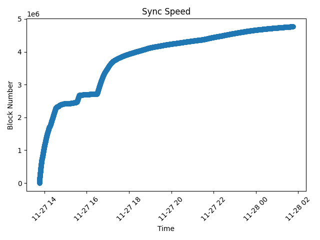

# Ethereum Node Sync Log Analyzer

## Overview

This Python script analyzes Ethereum node sync logs, extracts timestamps and corresponding block numbers, and visualizes the sync speed over time. It generates a plot and saves the data to a CSV file for further analysis.

## Features

- **Log Parsing:** Utilizes a LogParser class to read and parse the Ethereum node sync log file.
- **Data Extraction:** Extracts timestamps and block numbers from the log data using regular expressions.
- **Data Storage:** Stores the extracted data in a SyncData class for easy manipulation.
- **Data Visualization:** Utilizes Matplotlib to create a plot depicting the sync speed over time.
- **Data Export:** Saves the generated plot as an image file and exports the data to a CSV file.

## Usage

1. Clone the repository:

    ```bash
    git clone https://github.com/okpyjs/ethereum-node-sync-analyzer.git
    ```

2. Navigate to the project directory:

    ```bash
    cd ethereum-node-sync-analyzer
    ```

3. Install the required dependencies:

    ```bash
    pip install -r requirements.txt
    ```

4. Run the script:

    ```bash
    python sync_analyzer.py
    ```

5. Check the output:

    - The generated plot will be saved to `./output/time_to_number_plot.png`.
    - The CSV data will be saved to `./output/log.csv`.

## File Structure

- **`sync_analyzer.py`:** Main script containing the LogParser, SyncData, SyncView, and SyncController classes.
- **`ethereum-node-sync.log`:** Example Ethereum node sync log file.
- **`requirements.txt`:** List of Python dependencies.

## Dependencies

- Python 3.x
- Matplotlib
- Pandas

## Result



## License

This project is licensed under the MIT License.

## Acknowledgments

- [Matplotlib](https://matplotlib.org/)
- [Pandas](https://pandas.pydata.org/)

## Author

[Oleksandr Koniaiev](https://www.linkedin.com/in/oleksandr-koniaiev)
